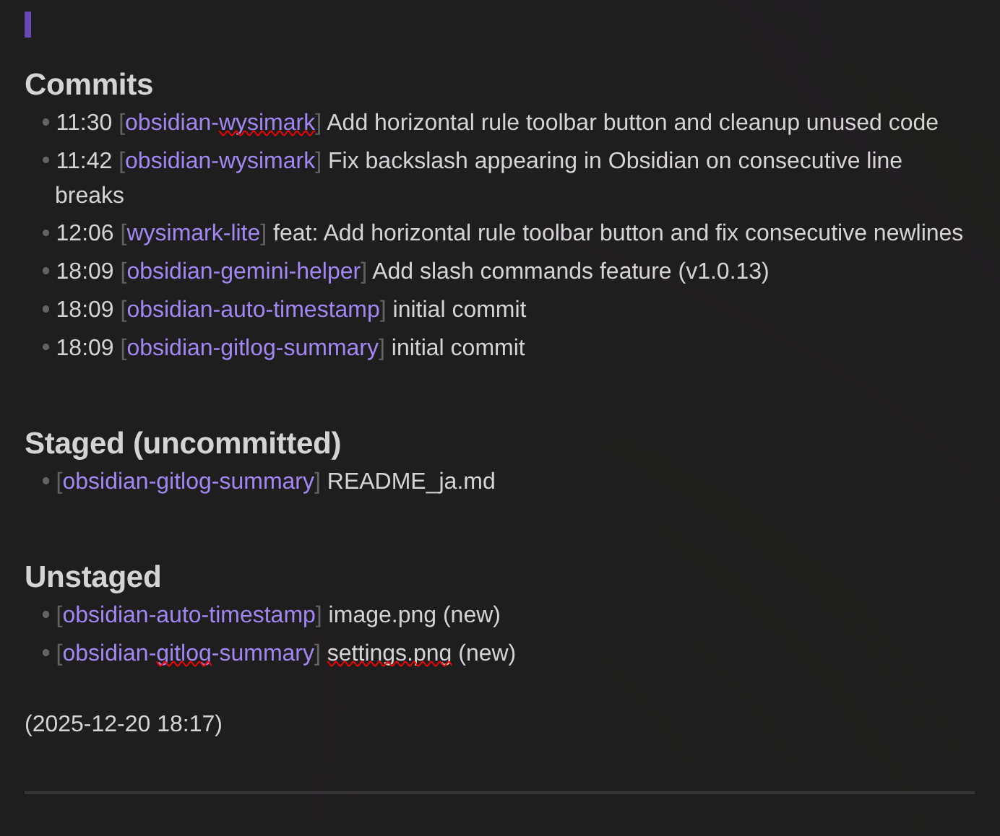
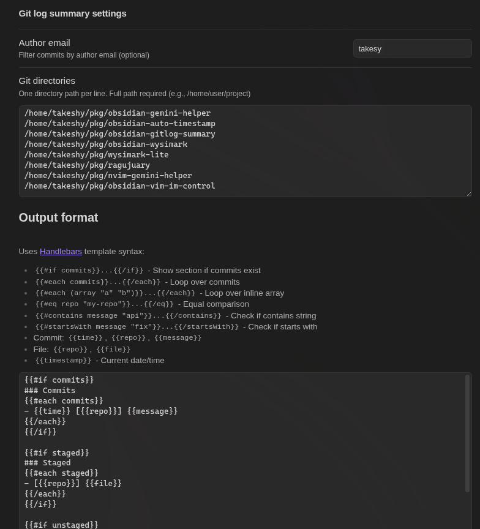

# Git Log Summary for Obsidian

An Obsidian plugin that inserts today's git log summary into your notes.

## Screenshots

### Usage


### Settings


## Features

- **Today's commits** - Insert all commits from today across multiple repositories
- **Multiple repositories** - Monitor multiple git directories at once
- **Staged changes** - Shows files that are staged but not yet committed
- **Unstaged changes** - Shows modified and untracked files
- **Author filtering** - Filter commits by author email (optional)
- **Time-sorted output** - Commits are sorted by time

## Output Format

The plugin inserts a formatted summary like this:

```markdown
### Commits
- 09:30 [project-a] Add new feature
- 10:45 [project-b] Fix bug in login

### Staged
- [project-a] src/index.ts

### Unstaged
- [project-b] README.md
- [project-b] config.json (new)
```

## Installation

### Manual Installation
1. Download the latest release (`main.js`, `manifest.json`)
2. Create a folder `gitlog-summary` in your vault's `.obsidian/plugins/` directory
3. Copy the downloaded files into the folder
4. Enable the plugin in Obsidian Settings > Community Plugins

### From Source
```bash
git clone https://github.com/takeshy/obsidian-gitlog-summary
cd obsidian-gitlog-summary
npm install
npm run build
```

Copy `main.js` and `manifest.json` to your vault's plugin folder.

## Configuration

### Author email
Filter commits by author email. Leave empty to show all authors.

### Git directories
Specify the git repositories to monitor, one per line.

**Important:** Full path required (e.g., `/home/user/project`). The `~` shortcut is not supported.

## Usage

1. Open a note where you want to insert the git log
2. Open the command palette (Ctrl/Cmd + P)
3. Search for "Insert today's Git log"
4. The git log summary will be inserted at the cursor position

## Requirements

- Obsidian v0.15.0 or higher
- Git installed and accessible from command line
- **Desktop only** - This plugin requires Node.js APIs and does not work on mobile

## Development

```bash
# Install dependencies
npm install

# Development build (watch mode)
npm run dev

# Production build
npm run build

# Lint
npm run lint
```

## License

MIT
